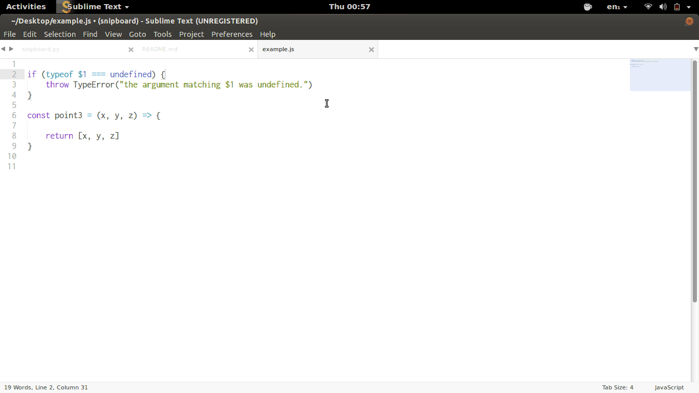

Snipboard v0.1.0
================

Snipboard adds light snippets to Sublime Text.

Sublime Text currently has snippets, but they several drawbacks:

* You have to leave your code to write a snippet.
* You have to write a lot of XML boilerplate.
* Snippets are stored permenantly, discouraging one-off snippets.

Tools with overhead are used sparingly next to immediate tools, so snippets are used less often than copy-paste and
multi-select when writing repetitive code.

Snipboard makes snippets as light and immediate as possible.


```bash
short snippet no. $1
```

Compared to

```xml
<snippet>
	<content><![CDATA['short snippet no. $1']]></content>
	<tabTrigger>$$</tabTrigger>
</snippet>
```


</img>

## Installation

You can install Snipboard in several ways. The easiest is by installing [Sublime Package Manager](https://sublime.wbond.net/installation)
and then:

* 1, Press <kbd>Ctrl + Shift + p</kbd>, and navigate to 'add repository'
* 2, Drop the URL for this package - https://github.com/rgrannell1/snipboard - into the text field.
* 3, Now press <kbd>Ctrl + Shift + p</kbd>, navigate to 'install package', and type 'snipboard'.

Using this method is preferable as you will automatically recieve updates. These
followind methods will also work if you don't use Sublime Package Manager.

### Ubuntu / Linux

```bash
cd ~/.config/sublime-text-3/Packages
git clone https://github.com/rgrannell1/snipboard.git
```

To upgrade run

```bash
cd ~/.config/sublime-text-3/Packages
rm -rf snipboard
git clone https://github.com/rgrannell1/snipboard.git
```

### OSX

```bash
cd ~/Library/Application\ Support/Sublime\ Text\ 2/Packages
git clone https://github.com/rgrannell1/snipboard.git
```

To upgrade run

```bash
cd ~/Library/Application\ Support/Sublime\ Text\ 2/Packages
rm -rf snipboard
git clone https://github.com/rgrannell1/snipboard.git
```

### Windows

```bash
cd "%AppData%\Sublime Text 3\Packages\User"
git clone https://github.com/rgrannell1/snipboard.git
```

## Shortcuts

* Copy Selection to Snipboard: <kbd>Ctrl+Shift+c</kbd>

## License

Snipboard is released under the MIT licence.

The MIT License (MIT)

Copyright (c) 2014 Ryan Grannell

Permission is hereby granted, free of charge, to any person obtaining a copy
of this software and associated documentation files (the "Software"), to deal
in the Software without restriction, including without limitation the rights
to use, copy, modify, merge, publish, distribute, sublicense, and/or sell
copies of the Software, and to permit persons to whom the Software is
furnished to do so, subject to the following conditions:

The above copyright notice and this permission notice shall be included in all
copies or substantial portions of the Software.

THE SOFTWARE IS PROVIDED "AS IS", WITHOUT WARRANTY OF ANY KIND, EXPRESS OR
IMPLIED, INCLUDING BUT NOT LIMITED TO THE WARRANTIES OF MERCHANTABILITY,
FITNESS FOR A PARTICULAR PURPOSE AND NONINFRINGEMENT. IN NO EVENT SHALL THE
AUTHORS OR COPYRIGHT HOLDERS BE LIABLE FOR ANY CLAIM, DAMAGES OR OTHER
LIABILITY, WHETHER IN AN ACTION OF CONTRACT, TORT OR OTHERWISE, ARISING FROM,
OUT OF OR IN CONNECTION WITH THE SOFTWARE OR THE USE OR OTHER DEALINGS IN THE
SOFTWARE.

## Versioning

All versions post-release will be compliant with the Semantic Versioning 2.0.0 standard.

http://semver.org/
